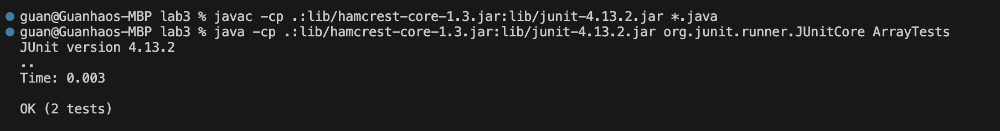

<h1>Lab Report 3</h1>
<h2>Part 1 Bugs</h2>
<h3>A failure-inducing input:</h3>
<br/>
```java
  @Test
  public void testReversed() {
    int[] input1 = {1,2,3,4,5};
    assertArrayEquals(new int[]{5,4,3,2,1}, ArrayExamples.reversed(input1));
  }
```
<p>The result is:</p>

<h3>An input that doesn't induce a failure:</h3>
```java
 @Test
  public void testReversed() {
    int[] input1 = {};
    assertArrayEquals(new int[]{}, ArrayExamples.reversed(input1));
  }
```
<p>The result is:</p>

<p>The symptom is:</p>


<p>Code with bug:</p>
```java

  static int[] reversed(int[] arr) {
    int[] newArray = new int[arr.length];
    for(int i = 0; i < arr.length; i += 1) {
      arr[i] = newArray[arr.length - i - 1];
    }
    return arr;
  }
  
```
<p>The code fix with switching newArray and arr, also the return changes to newArray:</p>

```java

  static int[] reversed(int[] arr) {
    int[] newArray = new int[arr.length];
    for(int i = 0; i < arr.length; i += 1) {
      newArray[i] = arr[arr.length-1-i];
    }
    return newArray;
  }

```
<p>Success Test:</p>

<h3>Describe why the fix addresses the issue:</h3>
The code before fix, inside the `for loop` the array `arr` is the one who changes. `newArray` is new created and it is empty. For every `i` the array `arr` is setting the value to `newArray` which are all 0s. After fixing the problem by switching their position, now `newArray` will store the integers in `arr` in a reverse order. At the end, I changed the `return arr` to `return newArray` to return the correct array result.

<h2>Part 2 Researching Commands</h2>
<h3>grep -ro 'Small' ./technical </h3>

<p>Doing recursive search on all the files and look at each line to search for 'Small', the result would be printing all the paths of the lines that contains the word in files without the text. -ro is a combination of -r and -o, -r is searching recursively, -o is output path but without the text that matches the word.</p>

```java
guan@Guanhaos-MBP docsearch % grep -ro 'Small' ./technical
./technical//government/Env_Prot_Agen/multi102902.txt:Small
./technical//government/Env_Prot_Agen/ctf1-6.txt:Small
./technical//government/Env_Prot_Agen/1-3_meth_901.txt:Small
./technical//government/Env_Prot_Agen/atx1-6.txt:Small
./technical//government/Gen_Account_Office/d0269g.txt:Small
./technical//government/Gen_Account_Office/Testimony_cg00010t.txt:Small
./technical//government/Gen_Account_Office/og97032.txt:Small
./technical//government/Gen_Account_Office/og99036.txt:Small
./technical//government/Gen_Account_Office/og99036.txt:Small
./technical//government/Gen_Account_Office/d01376g.txt:Small
./technical//government/Gen_Account_Office/pe1019.txt:Small
./technical//government/Gen_Account_Office/pe1019.txt:Small
./technical//government/Gen_Account_Office/d01121g.txt:Small
./technical//government/Gen_Account_Office/og96011.txt:Small
./technical//government/Gen_Account_Office/og96011.txt:Small
./technical//government/Gen_Account_Office/og97051.txt:Small
./technical//government/Gen_Account_Office/Testimony_d01609t.txt:Small
./technical//government/Gen_Account_Office/og97050.txt:Small
./technical//government/Gen_Account_Office/og96012.txt:Small
./technical//government/Gen_Account_Office/og96012.txt:Small
./technical//government/Gen_Account_Office/og96012.txt:Small
./technical//government/Gen_Account_Office/og97052.txt:Small
./technical//government/Gen_Account_Office/June30-2000_gg00135r.txt:Small
./technical//government/Gen_Account_Office/June30-2000_gg00135r.txt:Small
./technical//government/Gen_Account_Office/June30-2000_gg00135r.txt:Small
./technical//government/Gen_Account_Office/June30-2000_gg00135r.txt:Small
./technical//government/Gen_Account_Office/og96028.txt:Small
./technical//government/Gen_Account_Office/og96014.txt:Small
./technical//government/Gen_Account_Office/og96015.txt:Small
./technical//government/Gen_Account_Office/og96031.txt:Small
./technical//government/Gen_Account_Office/og96033.txt:Small
./technical//government/Gen_Account_Office/og96027.txt:Small
./technical//government/Gen_Account_Office/og96027.txt:Small
./technical//government/Gen_Account_Office/og98022.txt:Small
./technical//government/Gen_Account_Office/og96026.txt:Small
./technical//government/Gen_Account_Office/og96026.txt:Small
./technical//government/Gen_Account_Office/og96032.txt:Small
./technical//government/Gen_Account_Office/og96036.txt:Small
./technical//government/Gen_Account_Office/og96022.txt:Small
./technical//government/Gen_Account_Office/og96023.txt:Small
./technical//government/Gen_Account_Office/og96037.txt:Small
./technical//government/Gen_Account_Office/og96037.txt:Small
./technical//government/Gen_Account_Office/og98024.txt:Small
./technical//government/Gen_Account_Office/og96021.txt:Small
./technical//government/Gen_Account_Office/og96020.txt:Small
./technical//government/Gen_Account_Office/og96047.txt:Small
./technical//government/Gen_Account_Office/og98044.txt:Small
./technical//government/Gen_Account_Office/og96040.txt:Small
./technical//government/Gen_Account_Office/og97003.txt:Small
./technical//government/Gen_Account_Office/og96043.txt:Small
./technical//government/Gen_Account_Office/og96043.txt:Small
./technical//government/Post_Rate_Comm/ReportToCongress2002WEB.txt:Small
./technical//government/Media/Law_Schools.txt:Small
./technical//government/Media/Working_for_Free.txt:Small
./technical//government/Media/Disaster_center.txt:Small
./technical//government/Media/Using_Tech_Tools.txt:Small
./technical//government/Media/pro_bono_efforts.txt:Small
./technical//plos/journal.pbio.0020431.txt:Small
./technical//plos/pmed.0020075.txt:Small
./technical//plos/pmed.0020075.txt:Small
./technical//plos/journal.pbio.0020311.txt:Small
./technical//plos/journal.pbio.0020214.txt:Small
./technical//plos/pmed.0020242.txt:Small
./technical//biomed/1471-2199-2-10.txt:Small
./technical//biomed/1471-2334-3-9.txt:Small
./technical//biomed/1472-6947-3-8.txt:Small
./technical//biomed/1471-2229-2-3.txt:Small
./technical//biomed/1472-6785-1-3.txt:Small
./technical//biomed/gb-2001-2-8-research0027.txt:Small
./technical//biomed/gb-2003-4-5-r32.txt:Small
./technical//biomed/cc3.txt:Small
./technical//biomed/1471-2431-2-4.txt:Small
./technical//biomed/1471-2202-4-17.txt:Small
./technical//biomed/1471-2474-2-2.txt:Small
./technical//biomed/cc2190.txt:Small
./technical//biomed/1471-2105-3-12.txt:Small
./technical//biomed/gb-2001-2-9-research0035.txt:Small
./technical//biomed/bcr285.txt:Small
./technical//biomed/1472-6890-1-4.txt:Small
./technical//biomed/1471-2172-3-10.txt:Small
./technical//biomed/1472-6904-1-2.txt:Small
./technical//biomed/1471-213X-1-2.txt:Small
./technical//biomed/1471-2458-2-6.txt:Small
./technical//biomed/1471-2202-2-17.txt:Small
./technical//biomed/gb-2002-3-12-research0083.txt:Small
./technical//biomed/gb-2002-3-12-research0080.txt:Small
./technical//biomed/1471-2164-4-15.txt:Small
./technical//biomed/1477-7827-1-6.txt:Small
./technical//biomed/1475-4924-1-10.txt:Small
./technical//biomed/1471-2148-1-14.txt:Small
./technical//biomed/1471-2407-2-19.txt:Small
./technical//biomed/1471-2407-2-19.txt:Small
./technical//biomed/1471-2334-2-24.txt:Small
./technical//biomed/1471-2156-2-12.txt:Small
./technical//biomed/gb-2002-3-12-research0071.txt:Small
./technical//biomed/1476-4598-2-1.txt:Small
./technical//biomed/1471-2180-1-26.txt:Small
./technical//biomed/1471-2121-2-15.txt:Small
./technical//biomed/1471-2164-3-31.txt:Small
./technical//biomed/1472-6793-2-18.txt:Small
./technical//biomed/1471-2164-3-24.txt:Small
./technical//biomed/1471-2180-2-1.txt:Small
./technical//biomed/1471-2180-2-1.txt:Small
./technical//biomed/1471-2091-3-4.txt:Small
./technical//biomed/1471-2091-3-4.txt:Small
./technical//biomed/1471-2091-3-4.txt:Small
./technical//biomed/1471-2091-3-4.txt:Small
./technical//biomed/1472-6793-2-5.txt:Small
./technical//biomed/gb-2001-2-12-research0054.txt:Small
./technical//biomed/gb-2001-2-12-research0054.txt:Small
./technical//biomed/gb-2001-2-12-research0054.txt:Small
./technical//biomed/1471-2202-2-2.txt:Small
./technical//biomed/1471-2121-4-6.txt:Small
./technical//biomed/1472-6947-1-5.txt:Small
./technical//biomed/1471-2202-4-2.txt:Small
./technical//911report/chapter-13.4.txt:Small
./technical//911report/chapter-13.4.txt:Small
./technical//911report/chapter-13.4.txt:Small
./technical//911report/chapter-13.4.txt:Small
./technical//911report/chapter-13.4.txt:Small
./technical//911report/chapter-13.4.txt:Small
./technical//911report/chapter-13.5.txt:Small
./technical//911report/chapter-13.3.txt:Small
./technical//911report/chapter-13.3.txt:Small
./technical//911report/chapter-13.3.txt:Small
./technical//911report/chapter-13.3.txt:Small
./technical//911report/chapter-13.3.txt:Small
./technical//911report/chapter-13.3.txt:Small
./technical//911report/chapter-13.3.txt:Small
./technical//911report/chapter-13.3.txt:Small
./technical//911report/chapter-13.3.txt:Small
./technical//911report/chapter-13.3.txt:Small
./technical//911report/chapter-13.3.txt:Small
./technical//911report/chapter-13.3.txt:Small
./technical//911report/chapter-3.txt:Small
./technical//911report/chapter-3.txt:Small
./technical//911report/chapter-3.txt:Small
./technical//911report/chapter-3.txt:Small
./technical//911report/chapter-3.txt:Small
./technical//911report/chapter-3.txt:Small
./technical//911report/chapter-3.txt:Small
./technical//911report/chapter-3.txt:Small
./technical//911report/chapter-3.txt:Small
./technical//911report/chapter-5.txt:Small
./technical//911report/chapter-6.txt:Small
./technical//911report/chapter-6.txt:Small
./technical//911report/chapter-6.txt:Small
./technical//911report/chapter-6.txt:Small
./technical//911report/chapter-6.txt:Small
./technical//911report/chapter-11.txt:Small
```
<p>It prints the path of the files, and by how many times the file repeats means how many lines contains the word in technical folder.</p>

<h3>grep -ro 'Small' ./technical/911report </h3>
<p>Print all the file paths in repeating times depending on how many line would contain the word 'Samll'</p>
```java
guan@Guanhaos-MBP docsearch % grep -ro 'Small' ./technical/911report
./technical/911report/chapter-13.4.txt:Small
./technical/911report/chapter-13.4.txt:Small
./technical/911report/chapter-13.4.txt:Small
./technical/911report/chapter-13.4.txt:Small
./technical/911report/chapter-13.4.txt:Small
./technical/911report/chapter-13.4.txt:Small
./technical/911report/chapter-13.5.txt:Small
./technical/911report/chapter-13.3.txt:Small
./technical/911report/chapter-13.3.txt:Small
./technical/911report/chapter-13.3.txt:Small
./technical/911report/chapter-13.3.txt:Small
./technical/911report/chapter-13.3.txt:Small
./technical/911report/chapter-13.3.txt:Small
./technical/911report/chapter-13.3.txt:Small
./technical/911report/chapter-13.3.txt:Small
./technical/911report/chapter-13.3.txt:Small
./technical/911report/chapter-13.3.txt:Small
./technical/911report/chapter-13.3.txt:Small
./technical/911report/chapter-13.3.txt:Small
./technical/911report/chapter-3.txt:Small
./technical/911report/chapter-3.txt:Small
./technical/911report/chapter-3.txt:Small
./technical/911report/chapter-3.txt:Small
./technical/911report/chapter-3.txt:Small
./technical/911report/chapter-3.txt:Small
./technical/911report/chapter-3.txt:Small
./technical/911report/chapter-3.txt:Small
./technical/911report/chapter-3.txt:Small
./technical/911report/chapter-5.txt:Small
./technical/911report/chapter-6.txt:Small
./technical/911report/chapter-6.txt:Small
./technical/911report/chapter-6.txt:Small
./technical/911report/chapter-6.txt:Small
./technical/911report/chapter-6.txt:Small
./technical/911report/chapter-11.txt:Small
```
<p>It prints the path of the files, and by how many times the file repeats means how many lines contains the word in 911report folder inside technical folder.</p>

<h3>grep -ri 'hello' ./technical</h3>
<p>The -i option makes the search case-insensitive. This means it will match 'Hello', 'HELLO', 'hello', and any other case variations in the technical folder's file because of -r recursive search.</p>

```java
guan@Guanhaos-MBP docsearch % grep -ri 'hello' ./technical
./technical/911report/chapter-1.txt:    At 10:39, the Vice President updated the Secretary on the air threat conference: Vice President: There's been at least three instances here where we've had reports of aircraft approaching Washington-a couple were confirmed hijack. And, pursuant to the President's instructions I gave authorization for them to be taken out. Hello?
```
<p>It outputs the file path and the search result. We can see that in this paragraph, the word is Hello but using -i it still works.</p>

<h3>grep -ri 'hello' ./technical/911report</h3>
<p>The -i option makes the search case-insensitive. This means it will match 'Hello', 'HELLO', 'hello', and any other case variations in the technical folder's 911repot folder's file because of -r recursive search.</p>
```java
guan@Guanhaos-MBP docsearch % grep -ri 'hello' ./technical/911report
./technical/911report/chapter-1.txt:    At 10:39, the Vice President updated the Secretary on the air threat conference: Vice President: There's been at least three instances here where we've had reports of aircraft approaching Washington-a couple were confirmed hijack. And, pursuant to the President's instructions I gave authorization for them to be taken out. Hello?
```
<p>It prints the same result because there is only one file containing the word Hello.</p>

<h3>grep -row 'talk' ./technical</h3>
<p>Using -w ensures that grep matches the whole word 'talk'. Without this option, 'talk' might also match words like 'talking' or 'talks'. -ro is already explained on example one and two.</p>

```java
guan@Guanhaos-MBP docsearch % grep -row 'talk' ./technical
./technical/government/About_LSC/commission_report.txt:talk
./technical/government/About_LSC/ONTARIO_LEGAL_AID_SERIES.txt:talk
./technical/government/About_LSC/diversity_priorities.txt:talk
./technical/government/About_LSC/State_Planning_Report.txt:talk
./technical/government/Gen_Account_Office/ai9868.txt:talk
./technical/government/Gen_Account_Office/May1998_ai98068.txt:talk
./technical/government/Post_Rate_Comm/Gleiman_EMASpeech.txt:talk
./technical/government/Post_Rate_Comm/Gleiman_EMASpeech.txt:talk
./technical/government/Post_Rate_Comm/Gleiman_EMASpeech.txt:talk
./technical/government/Post_Rate_Comm/Mitchell_6-17-Mit.txt:talk
./technical/government/Media/Unusual_Woodburn.txt:talk
./technical/government/Media/Lindsays_legacy.txt:talk
./technical/government/Media/Lindsays_legacy.txt:talk
./technical/government/Media/Paralegal_Honored.txt:talk
./technical/government/Media/Texas_Lawyer.txt:talk
./technical/government/Media/Funds_Shortage.txt:talk
./technical/government/Media/Avoids_Budget_Cut.txt:talk
./technical/government/Media/Assuring_Underprivileged.txt:talk
./technical/government/Media/Firm_to_the_Poor_Needs_Help.txt:talk
./technical/government/Media/Local_Attorneys.txt:talk
./technical/government/Media/Library_Lawyers.txt:talk
./technical/government/Media/Pro-bono_road_show.txt:talk
./technical/plos/pmed.0020203.txt:talk
./technical/plos/journal.pbio.0020262.txt:talk
./technical/plos/journal.pbio.0020311.txt:talk
./technical/plos/journal.pbio.0020311.txt:talk
./technical/plos/journal.pbio.0020310.txt:talk
./technical/plos/journal.pbio.0020064.txt:talk
./technical/plos/pmed.0010042.txt:talk
./technical/plos/pmed.0020209.txt:talk
./technical/plos/journal.pbio.0020012.txt:talk
./technical/biomed/1471-2407-3-18.txt:talk
./technical/biomed/1471-244X-2-9.txt:talk
./technical/biomed/1472-6815-2-3.txt:talk
./technical/biomed/1471-2458-2-25.txt:talk
./technical/biomed/1472-6947-2-7.txt:talk
./technical/biomed/1472-6963-3-14.txt:talk
./technical/biomed/1472-6963-3-14.txt:talk
./technical/biomed/1475-925X-2-3.txt:talk
./technical/biomed/1471-213X-2-8.txt:talk
./technical/biomed/1477-7827-1-23.txt:talk
./technical/biomed/1471-2164-2-2.txt:talk
./technical/biomed/gb-2002-3-10-research0056.txt:talk
./technical/biomed/1471-2202-3-17.txt:talk
./technical/biomed/1478-1336-1-3.txt:talk
./technical/biomed/1476-4598-1-6.txt:talk
./technical/911report/chapter-13.5.txt:talk
./technical/911report/chapter-13.5.txt:talk
./technical/911report/chapter-13.3.txt:talk
./technical/911report/chapter-3.txt:talk
./technical/911report/chapter-1.txt:talk
./technical/911report/chapter-1.txt:talk
./technical/911report/chapter-1.txt:talk
./technical/911report/chapter-9.txt:talk
```
<p>It outputs all the paths of lines that has the word exact match to word 'talk' in the files inside technical folder</p>
<h3>grep -row 'talk' ./technical/biomed</h3>
<p>Search the word 'talk in files inside biomed folder inside technical folder</p>
```java
guan@Guanhaos-MBP docsearch % grep -row 'talk' ./technical/biomed
./technical/biomed/1471-2407-3-18.txt:talk
./technical/biomed/1471-244X-2-9.txt:talk
./technical/biomed/1472-6815-2-3.txt:talk
./technical/biomed/1471-2458-2-25.txt:talk
./technical/biomed/1472-6947-2-7.txt:talk
./technical/biomed/1472-6963-3-14.txt:talk
./technical/biomed/1472-6963-3-14.txt:talk
./technical/biomed/1475-925X-2-3.txt:talk
./technical/biomed/1471-213X-2-8.txt:talk
./technical/biomed/1477-7827-1-23.txt:talk
./technical/biomed/1471-2164-2-2.txt:talk
./technical/biomed/gb-2002-3-10-research0056.txt:talk
./technical/biomed/1471-2202-3-17.txt:talk
./technical/biomed/1478-1336-1-3.txt:talk
./technical/biomed/1476-4598-1-6.txt:talk
```
<p>It outputs all the paths of lines that has the word exact match to word 'talk' in the files inside biomed folder inside technical folder</p>

<h3>grep -ron 'talk' ./technical</h3>
<p>-n Display the matched lines and their line numbers. -ro are described and used in previous examples</p>
```java
guan@Guanhaos-MBP docsearch % grep -ron 'talk' ./technical
./technical/government/About_LSC/Strategic_report.txt:404:talk
./technical/government/About_LSC/Comments_on_semiannual.txt:340:talk
./technical/government/About_LSC/commission_report.txt:1401:talk
./technical/government/About_LSC/commission_report.txt:1702:talk
./technical/government/About_LSC/ONTARIO_LEGAL_AID_SERIES.txt:8:talk
./technical/government/About_LSC/diversity_priorities.txt:347:talk
./technical/government/About_LSC/State_Planning_Report.txt:112:talk
./technical/government/About_LSC/State_Planning_Report.txt:134:talk
./technical/government/Alcohol_Problems/DraftRecom-PDF.txt:160:talk
./technical/government/Gen_Account_Office/d0269g.txt:699:talk
./technical/government/Gen_Account_Office/pe1019.txt:142:talk
./technical/government/Gen_Account_Office/pe1019.txt:331:talk
./technical/government/Gen_Account_Office/ai9868.txt:1132:talk
./technical/government/Gen_Account_Office/Paper_Walker11-2002_acpro122.txt:72:talk
./technical/government/Gen_Account_Office/May1998_ai98068.txt:1132:talk
./technical/government/Post_Rate_Comm/Gleiman_EMASpeech.txt:40:talk
./technical/government/Post_Rate_Comm/Gleiman_EMASpeech.txt:45:talk
./technical/government/Post_Rate_Comm/Gleiman_EMASpeech.txt:47:talk
./technical/government/Post_Rate_Comm/Gleiman_EMASpeech.txt:222:talk
./technical/government/Post_Rate_Comm/Gleiman_EMASpeech.txt:317:talk
./technical/government/Post_Rate_Comm/Gleiman_gca2000.txt:200:talk
./technical/government/Post_Rate_Comm/Gleiman_gca2000.txt:570:talk
./technical/government/Post_Rate_Comm/Gleiman_gca2000.txt:575:talk
./technical/government/Post_Rate_Comm/Mitchell_6-17-Mit.txt:704:talk
./technical/government/Media/Unusual_Woodburn.txt:28:talk
./technical/government/Media/Anthem_Payout.txt:80:talk
./technical/government/Media/Legal_system_fails_poor.txt:107:talk
./technical/government/Media/Lindsays_legacy.txt:16:talk
./technical/government/Media/Lindsays_legacy.txt:85:talk
./technical/government/Media/Domestic_Violence_Ruling.txt:40:talk
./technical/government/Media/Law_Schools.txt:62:talk
./technical/government/Media/Paralegal_Honored.txt:52:talk
./technical/government/Media/Paralegal_Honored.txt:53:talk
./technical/government/Media/Working_for_Free.txt:92:talk
./technical/government/Media/help_rent-to-own_tenants.txt:26:talk
./technical/government/Media/Texas_Lawyer.txt:72:talk
./technical/government/Media/Funds_Shortage.txt:69:talk
./technical/government/Media/Avoids_Budget_Cut.txt:21:talk
./technical/government/Media/Assuring_Underprivileged.txt:73:talk
./technical/government/Media/Assuring_Underprivileged.txt:133:talk
./technical/government/Media/Firm_to_the_Poor_Needs_Help.txt:71:talk
./technical/government/Media/Local_Attorneys.txt:109:talk
./technical/government/Media/Library_Lawyers.txt:55:talk
./technical/government/Media/CommercialAppealMemphis2.txt:96:talk
./technical/government/Media/Farm_workers.txt:27:talk
./technical/government/Media/Understanding.txt:18:talk
./technical/government/Media/Pro-bono_road_show.txt:59:talk
./technical/government/Media/Greedy_Generous.txt:101:talk
./technical/government/Media/Retirement_Has_Its_Appeal.txt:10:talk
./technical/government/Media/Retirement_Has_Its_Appeal.txt:97:talk
./technical/plos/pmed.0010010.txt:95:talk
./technical/plos/journal.pbio.0020169.txt:92:talk
./technical/plos/pmed.0020206.txt:55:talk
./technical/plos/journal.pbio.0020047.txt:30:talk
./technical/plos/pmed.0020203.txt:60:talk
./technical/plos/journal.pbio.0020440.txt:79:talk
./technical/plos/journal.pbio.0020262.txt:24:talk
./technical/plos/journal.pbio.0020262.txt:85:talk
./technical/plos/journal.pbio.0020073.txt:73:talk
./technical/plos/journal.pbio.0020113.txt:81:talk
./technical/plos/journal.pbio.0020311.txt:121:talk
./technical/plos/journal.pbio.0020311.txt:140:talk
./technical/plos/journal.pbio.0020310.txt:8:talk
./technical/plos/journal.pbio.0020310.txt:168:talk
./technical/plos/journal.pbio.0020272.txt:41:talk
./technical/plos/journal.pbio.0020272.txt:42:talk
./technical/plos/journal.pbio.0020064.txt:172:talk
./technical/plos/journal.pbio.0020064.txt:190:talk
./technical/plos/pmed.0010042.txt:42:talk
./technical/plos/pmed.0020209.txt:10:talk
./technical/plos/pmed.0020209.txt:50:talk
./technical/plos/journal.pbio.0020012.txt:213:talk
./technical/biomed/1471-2407-3-18.txt:185:talk
./technical/biomed/1471-2407-3-18.txt:202:talk
./technical/biomed/1471-2229-2-3.txt:46:talk
./technical/biomed/1471-2458-3-5.txt:395:talk
./technical/biomed/1471-2431-2-4.txt:222:talk
./technical/biomed/1471-2431-2-4.txt:240:talk
./technical/biomed/1471-244X-2-9.txt:443:talk
./technical/biomed/1471-2180-1-8.txt:279:talk
./technical/biomed/1471-2180-1-8.txt:280:talk
./technical/biomed/1471-213X-3-3.txt:19:talk
./technical/biomed/1471-213X-3-3.txt:25:talk
./technical/biomed/1471-213X-3-3.txt:318:talk
./technical/biomed/1471-213X-3-3.txt:326:talk
./technical/biomed/1471-213X-1-3.txt:135:talk
./technical/biomed/1471-2431-3-4.txt:636:talk
./technical/biomed/1471-213X-1-6.txt:244:talk
./technical/biomed/1471-213X-1-6.txt:267:talk
./technical/biomed/1472-6815-2-3.txt:430:talk
./technical/biomed/1471-213X-3-7.txt:337:talk
./technical/biomed/1471-2334-2-24.txt:39:talk
./technical/biomed/1472-684X-2-1.txt:256:talk
./technical/biomed/1471-2121-2-11.txt:477:talk
./technical/biomed/1471-2105-3-18.txt:280:talk
./technical/biomed/1471-2458-2-25.txt:426:talk
./technical/biomed/gb-2003-4-3-r20.txt:565:talk
./technical/biomed/1472-6947-2-7.txt:586:talk
./technical/biomed/1472-6963-3-14.txt:67:talk
./technical/biomed/1472-6963-3-14.txt:69:talk
./technical/biomed/1472-6963-3-14.txt:198:talk
./technical/biomed/1472-6963-3-14.txt:227:talk
./technical/biomed/1475-925X-2-3.txt:48:talk
./technical/biomed/1475-2867-2-7.txt:63:talk
./technical/biomed/1472-6882-1-10.txt:72:talk
./technical/biomed/1472-6882-1-10.txt:1422:talk
./technical/biomed/1471-213X-2-8.txt:152:talk
./technical/biomed/1477-7827-1-23.txt:489:talk
./technical/biomed/1471-2164-2-2.txt:451:talk
./technical/biomed/gb-2002-3-10-research0056.txt:768:talk
./technical/biomed/1471-2202-3-17.txt:423:talk
./technical/biomed/1478-1336-1-3.txt:68:talk
./technical/biomed/1476-4598-1-6.txt:554:talk
./technical/911report/chapter-13.4.txt:1004:talk
./technical/911report/chapter-13.4.txt:1239:talk
./technical/911report/chapter-13.4.txt:1532:talk
./technical/911report/chapter-13.4.txt:1594:talk
./technical/911report/chapter-13.4.txt:1747:talk
./technical/911report/chapter-13.4.txt:1753:talk
./technical/911report/chapter-13.4.txt:1754:talk
./technical/911report/chapter-13.4.txt:1817:talk
./technical/911report/chapter-13.5.txt:639:talk
./technical/911report/chapter-13.5.txt:645:talk
./technical/911report/chapter-13.5.txt:1200:talk
./technical/911report/chapter-13.5.txt:1835:talk
./technical/911report/chapter-13.1.txt:123:talk
./technical/911report/chapter-13.2.txt:909:talk
./technical/911report/chapter-13.3.txt:1130:talk
./technical/911report/chapter-13.3.txt:1238:talk
./technical/911report/chapter-13.3.txt:1317:talk
./technical/911report/chapter-13.3.txt:1427:talk
./technical/911report/chapter-13.3.txt:1430:talk
./technical/911report/chapter-13.3.txt:1449:talk
./technical/911report/chapter-13.3.txt:1513:talk
./technical/911report/chapter-13.3.txt:1589:talk
./technical/911report/chapter-13.3.txt:1602:talk
./technical/911report/chapter-13.3.txt:1617:talk
./technical/911report/chapter-13.3.txt:1672:talk
./technical/911report/chapter-13.3.txt:1673:talk
./technical/911report/chapter-13.3.txt:1694:talk
./technical/911report/chapter-3.txt:2241:talk
./technical/911report/chapter-3.txt:2244:talk
./technical/911report/chapter-3.txt:2298:talk
./technical/911report/chapter-3.txt:2514:talk
./technical/911report/chapter-3.txt:2676:talk
./technical/911report/chapter-1.txt:366:talk
./technical/911report/chapter-1.txt:382:talk
./technical/911report/chapter-1.txt:476:talk
./technical/911report/chapter-1.txt:486:talk
./technical/911report/chapter-1.txt:564:talk
./technical/911report/chapter-1.txt:606:talk
./technical/911report/chapter-1.txt:622:talk
./technical/911report/chapter-6.txt:1238:talk
./technical/911report/chapter-6.txt:1238:talk
./technical/911report/chapter-6.txt:1493:talk
./technical/911report/chapter-6.txt:1501:talk
./technical/911report/chapter-6.txt:1804:talk
./technical/911report/chapter-7.txt:266:talk
./technical/911report/chapter-7.txt:741:talk
./technical/911report/chapter-9.txt:719:talk
./technical/911report/chapter-8.txt:294:talk
./technical/911report/chapter-8.txt:380:talk
./technical/911report/chapter-12.txt:6:talk
./technical/911report/chapter-12.txt:215:talk
./technical/911report/chapter-10.txt:192:talk
./technical/911report/chapter-11.txt:204:talk
```
<p>Using -n not only prints the path of the files inside technical folder, but also the line number after the path.</p>
<h3>grep -ron 'talk' ./technical/biomed</h3>
```java
guan@Guanhaos-MBP docsearch % grep -ron 'talk' ./technical/biomed
./technical/biomed/1471-2407-3-18.txt:185:talk
./technical/biomed/1471-2407-3-18.txt:202:talk
./technical/biomed/1471-2229-2-3.txt:46:talk
./technical/biomed/1471-2458-3-5.txt:395:talk
./technical/biomed/1471-2431-2-4.txt:222:talk
./technical/biomed/1471-2431-2-4.txt:240:talk
./technical/biomed/1471-244X-2-9.txt:443:talk
./technical/biomed/1471-2180-1-8.txt:279:talk
./technical/biomed/1471-2180-1-8.txt:280:talk
./technical/biomed/1471-213X-3-3.txt:19:talk
./technical/biomed/1471-213X-3-3.txt:25:talk
./technical/biomed/1471-213X-3-3.txt:318:talk
./technical/biomed/1471-213X-3-3.txt:326:talk
./technical/biomed/1471-213X-1-3.txt:135:talk
./technical/biomed/1471-2431-3-4.txt:636:talk
./technical/biomed/1471-213X-1-6.txt:244:talk
./technical/biomed/1471-213X-1-6.txt:267:talk
./technical/biomed/1472-6815-2-3.txt:430:talk
./technical/biomed/1471-213X-3-7.txt:337:talk
./technical/biomed/1471-2334-2-24.txt:39:talk
./technical/biomed/1472-684X-2-1.txt:256:talk
./technical/biomed/1471-2121-2-11.txt:477:talk
./technical/biomed/1471-2105-3-18.txt:280:talk
./technical/biomed/1471-2458-2-25.txt:426:talk
./technical/biomed/gb-2003-4-3-r20.txt:565:talk
./technical/biomed/1472-6947-2-7.txt:586:talk
./technical/biomed/1472-6963-3-14.txt:67:talk
./technical/biomed/1472-6963-3-14.txt:69:talk
./technical/biomed/1472-6963-3-14.txt:198:talk
./technical/biomed/1472-6963-3-14.txt:227:talk
./technical/biomed/1475-925X-2-3.txt:48:talk
./technical/biomed/1475-2867-2-7.txt:63:talk
./technical/biomed/1472-6882-1-10.txt:72:talk
./technical/biomed/1472-6882-1-10.txt:1422:talk
./technical/biomed/1471-213X-2-8.txt:152:talk
./technical/biomed/1477-7827-1-23.txt:489:talk
./technical/biomed/1471-2164-2-2.txt:451:talk
./technical/biomed/gb-2002-3-10-research0056.txt:768:talk
./technical/biomed/1471-2202-3-17.txt:423:talk
./technical/biomed/1478-1336-1-3.txt:68:talk
./technical/biomed/1476-4598-1-6.txt:554:talk
```
<p>Using -n not only prints the path of the files inside biomed folder inside technical folder, but also the line number after the path.</p>

<h3>Reference:</h3>
<p>The website that I find all this interesting commands:</p>
<p>https://www.geeksforgeeks.org/grep-command-in-unixlinux/</p>
