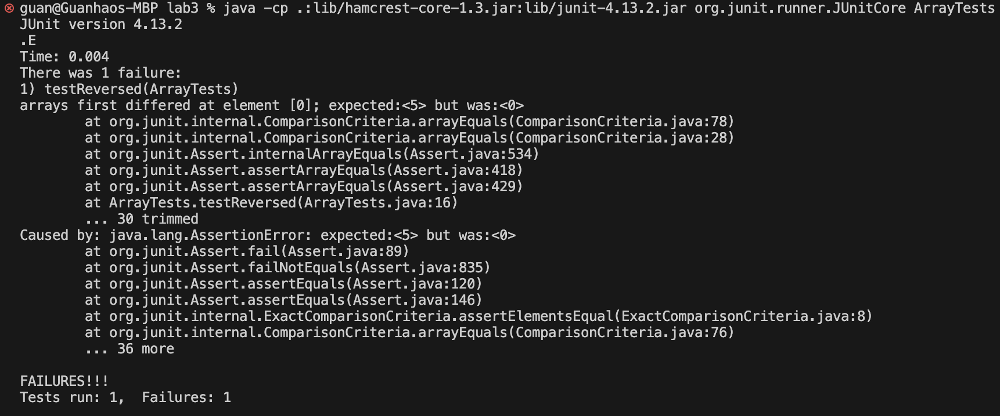
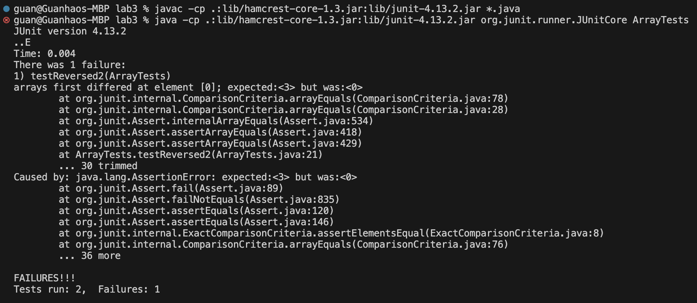

<h1>Lab Report 3</h1>
<h2>Part 1 Bugs</h2>
<h3>A failure-inducing input:</h3>
<br/>
```java
  @Test
  public void testReversed() {
    int[] input1 = {1,2,3,4,5};
    assertArrayEquals(new int[]{5,4,3,2,1}, ArrayExamples.reversed(input1));
  }
```
<p>The result is:</p>

<h3>An input that doesn't induce a failure:</h3>
```java
 @Test
  public void testReversed() {
    int[] input1 = {};
    assertArrayEquals(new int[]{}, ArrayExamples.reversed(input1));
  }
```
<p>The result is:</p>

<p>The symptom is:</p>


<p>Code with bug:</p>
```java

  static int[] reversed(int[] arr) {
    int[] newArray = new int[arr.length];
    for(int i = 0; i < arr.length; i += 1) {
      arr[i] = newArray[arr.length - i - 1];
    }
    return arr;
  }
  
```
<p>The code fix with switching newArray and arr, also the return changes to newArray</p>
